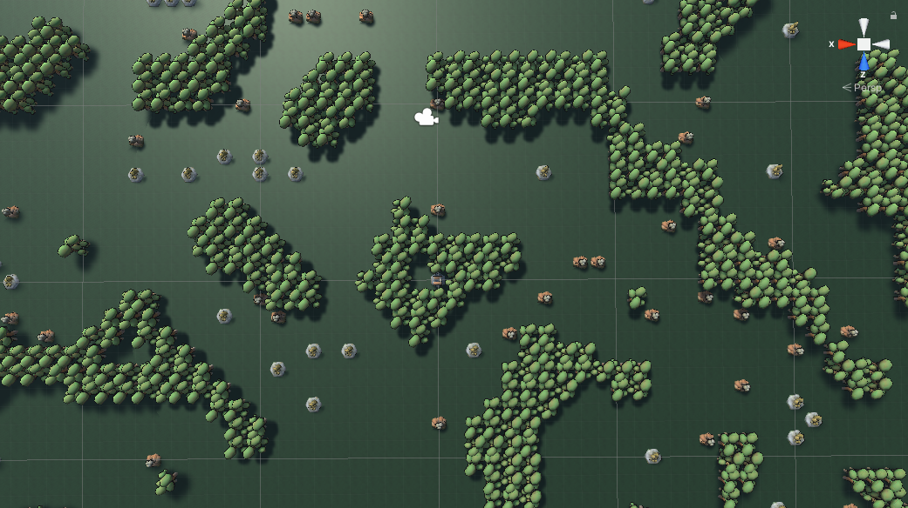
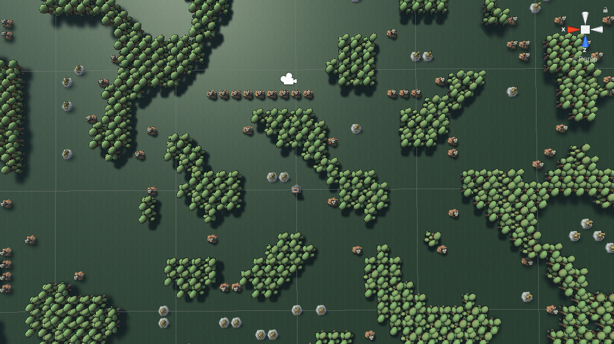
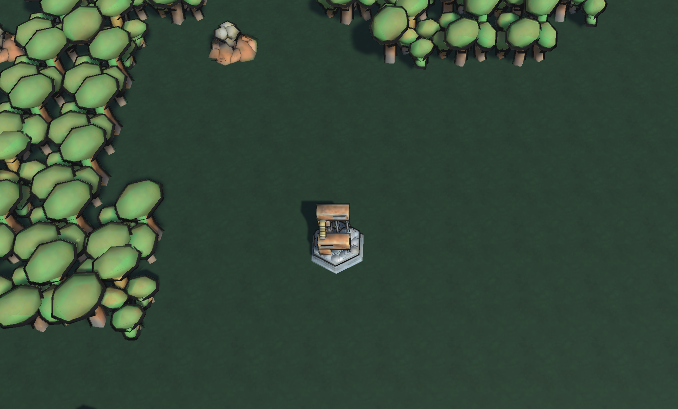
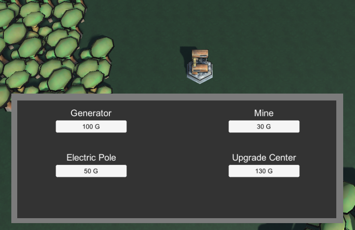

# Factory Game
## Projekt jest prototypem factory buildera
Aktualnym i jedynym celem jest ulepszanie prędkości zbierania surowców
ale aby projekt można było ciekawiej rozbudować warto byłoby zmienić parę
rzeczy w kodzie.
## Mapa
Cala mapa jest generowana na bazie Perlin noisa który jest tworzony na nowo
za każdym kolejnym włączeniem gry.





System gridu do którego się przyczepiają obiekty na mapie jest tworzony
za pomocą zwykłych plane'ów które maja swoje własne skrypty.
Aktualnie jest to bardzo ograniczony grid system ponieważ
mapa może mieć tylko wielkość 
100 x 100 inaczej kod nie będzie
użyteczny.


I właśnie wszystkie podstawowe obiekty takie jak drzewa i dwa rodzaje surowców są
wstawiane na mapę w zależności od wartości koloru miedzy 
0f a 1f który jest wyciągany
z wcześniej wygenerowanej textury perlin noisa
```csharp
private void WorldObstaclePlacement()
{
    for (int x = 0; x < 100; x++)
    {
        for (int y = 0; y < 100; y++)
        {
            float perlVal = heightMap.texture.GetPixel(x, y).grayscale;

            if (perlVal > 0 && perlVal < 0.33f)
                LocationForObj(TreePrefab, x, y, true);
            else if (perlVal > 0.47 && perlVal < 0.48)
                LocationForObj(GasePrefab, x, y, false);
            else if (perlVal > 0.78 && perlVal < 0.80)
                LocationForObj(GoldPrefab, x, y, false);
        }
    }
}
```

## HUB
Gracz zaczyna zawsze w miejscu położenia głównego huba



Głównie dzieki głównemu hubowi można dostać sie do głownego UI
budowy budynków gdzie w zależności od ilości golda można wybrać jakąś budowlę


## Inputy Gracza

Żeby gracz miał wizualizacje tego gdzie stawia obiekt
pod lokacją jego kursora jest snapowany 

```csharp
private void HoldObjOnMouse(GameObject obj)
{
    ray = cam.ScreenPointToRay(Input.mousePosition);
    if (Physics.Raycast(ray, out hit, Mathf.Infinity))
    {
        obj.transform.position = hit.collider.gameObject.transform.position;
        if (Input.GetMouseButtonUp(1))
            SetPointToStay(obj, hit.collider.gameObject.transform.position);
        else if (Input.GetKeyDown(KeyCode.Escape))
        {
            Destroy(heldObject.gameObject);
            heldObject = null;
        }
    }
}
```
Jak widać w kodzie powyżej jeżeli gracz zdecyduję się postawić obiekt
sprawdzamy czy ten punkt jest pusty do czego potrzebujemy informacji wejściowych.
Wykorzystuje je poniższa funkcja która sprawdza jaki obiekt jest trzymany
i odpowiednio do tego wykonuję dane czynności zaczynające się gdy obiekt jest
kładziony.

```csharp
private void SetPointToStay(GameObject heldObject, Vector3 planePosition);
```

Gracz zanim będzie stawiać obiekt musi wybrać jaki chce
postawić a robi to poprzez guziki w UI do których 
są przypięte funkcje tego typu. W każdej takiej 
funkcji program sprawdza ile gracz ma danej waluty
i czy już czegoś nie "trzyma".

```csharp
public void SpawnMineInWorld()
{
    if (heldObject == null && gameMode.goldVal >= 30)
    {
        gameMode.goldVal -= 30;
        heldObject = Instantiate(MinePrefab, new Vector3(20, 0, 20), Quaternion.identity);

    }
}
```
## Podsumowanie 
Jest to mój pierwszy "większy" projekt w Uinty i raczej bardzo dużo rzeczy bym teraz poprawił, zmienił
lub inaczej zaprojektował, ale dzięki pracy przy tym projekcie na pewno nauczyłem się sporej ilości rzeczy 
na temat zasady działania kodu w unity i samego programu.


 
